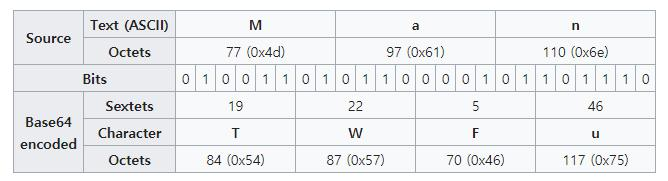

# **뉴스기사 3줄 요약하기**

---
### 📝 **기본 지식**
> 바이너리 파일을 문자열로 변경 - base64  
> 문자열 다루기 - textwrap, re  
> 단어 개수 구하기 - collections.Counter  
> 문서 요약하기 - gensim  
> 텍스트 파일 저장 - open, close  
> 프로젝트 실습

 

## [바이너리 파일을 문자열로 변경-base64](https://github.com/qsdcfd/Python_Project/blob/TIL/Simple_Project/Text_summary/02.%20%E1%84%87%E1%85%A1%E1%84%8B%E1%85%B5%E1%84%82%E1%85%A5%E1%84%85%E1%85%B5%20%E1%84%91%E1%85%A1%E1%84%8B%E1%85%B5%E1%86%AF%E1%84%8B%E1%85%B3%E1%86%AF%20%E1%84%86%E1%85%AE%E1%86%AB%E1%84%8C%E1%85%A1%E1%84%8B%E1%85%A7%E1%86%AF%E1%84%85%E1%85%A9%20%E1%84%87%E1%85%A7%E1%86%AB%E1%84%80%E1%85%A7%E1%86%BC%20-%20base64.py)

> ### **바이너리 파일 (Binary file)** 
>       
>
> - 바이너리 파일이란 ‘0’ 과 ‘1’ 을 이용한 **2진수 데이터** 만으로만으로 인코딩된 파일
> - 사람이 직접 읽을 수 없다
> - 데이터를 효율적으로 처리, 저장, 실행 등을 목적으로 만들어진 파일
> - 장점
>    - 데이터를 처리하고 전송하는데 일반적으로 비용이 적게 든다.
>    - 텍스트 파일에 비해서 데이터 처리 속도가 빠르다.
>    - 데이터 저장 공간도 적게 듦
> - 대표적인 확장자 : exe, dll, zip, rar, mp3, mpg, jpg, png 등

 

> ### **Base64 인코딩**
> - 다양한 통신채널 (HTML, 이메일 등) 을 통해 **바이너리 데이터**를 **안전하게 전송**할 수 있게 하는 방법
> - ASCII, Unicode 인코딩과 함께 실생활에서도 많이 사용되는 인코딩 방법
> - ASCII (8bit) 인코딩은 프로토콜,시스템마다 다르게 해석되어 데이터가 왜곡될 여지가 있기 때문에 적합하지 않음
> - XML이나 HTTP 프로토콜에서도 특수문자 파싱 문제를 해결할 수 있는 수단
> - 64 진법은 ASCII문자들을 모두 표현할 수 있는 가장 작은 진법
>    - `문자열 입력` -> `ASCII/Binary (8bit)` -> `6bit cut` -> `base64`
> - [Base64 인코딩 테이블](https://en.wikipedia.org/wiki/Base64)
> 
